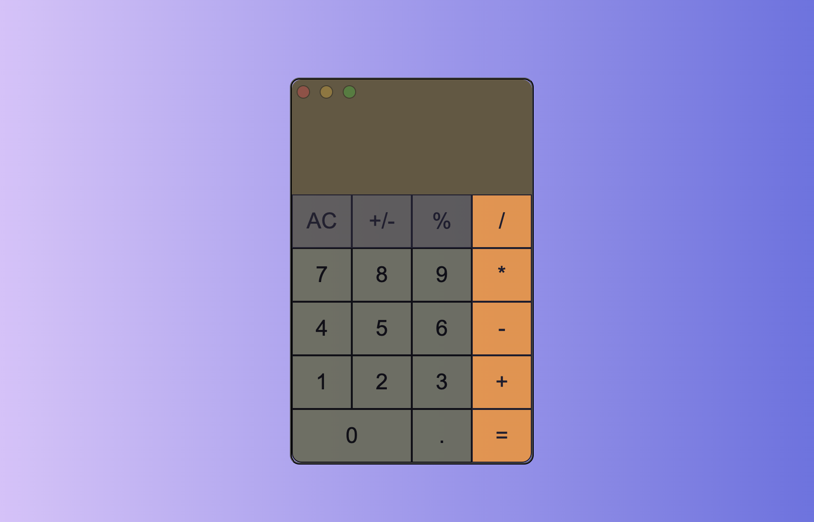

	

	

# calculator

## Project 🖥️

This is a web project I created to train my HTML and CSS skills.

The challenge was to create an calculator app mimicking the Apple Macbook's calculator app appereance. Also, when I developed the project I had no Javascript knowledge, so I decide not to use JavaScript in it.

## Technologies 🚀
This project have uses the folowing technologies:
- HTML
- CSS
- Git and Github
- Javacript (just kidding :D)

